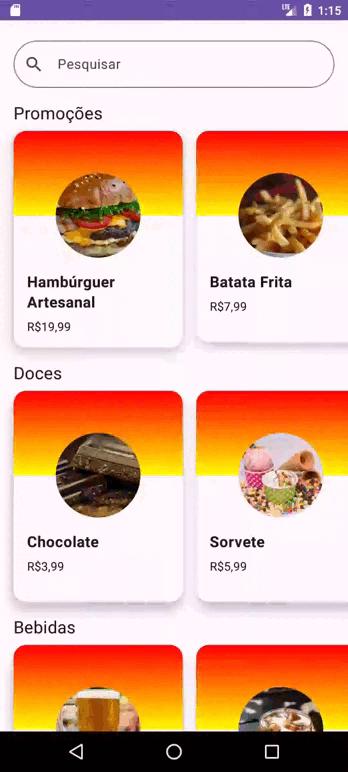

# Sabor Express - App Android

App Android desenvolvido com o Jetpack Compose para simular um sistema de pedidos de comida.

:construction: Projeto em desenvolvimento :construction:

## 🔨 Funcionalidades do projeto

O app utiliza a biblioteca do Coil para buscar as imagens dos produtos via URL. Com a implmentação de Lazy Layouts e Estados para otimizar a exibe dos produtos.

## ✔️ Técnicas e tecnologias utilizadas
* Android
* Kotlin
* Jetpack Compose
* Coroutines
* Coil

## 🤝 Contribuições

- Contribuições são bem-vindas! Sinta-se à vontade para abrir problemas, propor melhorias ou enviar solicitações de pull.

⭐️ Star o projeto

🐛 Encontrar e relatar issues